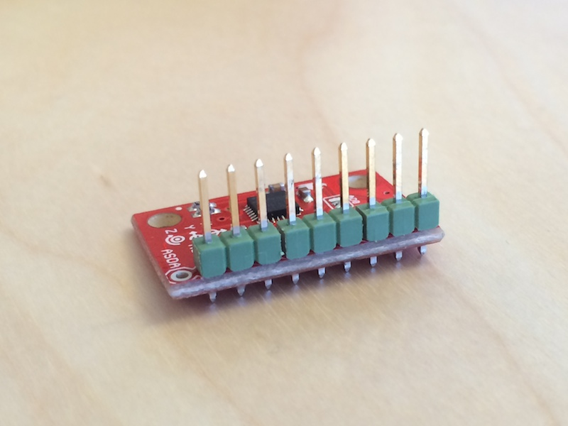

This tutorial is part of a [tutorial series on the Nordic Pucks](../tutorials.html).
I am assuming that you have already read the [introduction tutorial] and the [location puck tutorial](location.html).

In this tutorial, we will be building a cube puck, which is an innovative, new, bluetooth-enabled, situated and immersed remote control device.
The cube puck is a six-sided cube that can be rotated to any of its six sides to invoke the semantics linked to that side.
It is completely customizable and therefore also quite versatile.

> 
> Artist's rendition of what a cube might look like.

# Requirements
- 1x [Nordic nRF51822 mbed mKIT development board](https://mbed.org/platforms/Nordic-nRF51822/)
- 1x [MPU5060 IMU (Inertial measurement unit)](https://www.sparkfun.com/products/11028)
- 2x header pins
- 5x [Female to Female jumper wires](http://www.seeedstudio.com/depot/1-pin-dualfemale-jumper-wire-100mm-50pcs-pack-p-260.html?cPath=44_47)

# Hardware

The cube puck consists of an MPU5060 Intertial Measurement Unit wired together to an nRF51822 mbed.
We are going to use the IMU to determine on which side the cube is currently resting.
The MPU5060 IMU comes pre-soldered onto a breakout board, so we will need to connect it to our mbed using wires.
We soldered some header pins to our IMU breakout board to allow easy wire connection, but you can also solder your wires directly onto the through-holes.

> 
> Some header pins soldered onto the MP5060 breakout board through-holes.

In order to communicate with the MPU5060, will need to set up an [I2C](http://en.wikipedia.org/wiki/I%C2%B2C) connection between the mbed board and the MPU5060, as well as connect power and ground.
The following table shows the wire mappings used in this project.
The MPU5060 also supports interrupts using the INT pin, but we will not be using it in this tutorial.

> |-------------------|---------------|
> | mbed nRF pin      | MPU5060 pin   |
> |-------------------|---------------|
> | VCC               | VDD           |
> |-------------------|---------------|
> | VCC               | VIO           |
> |-------------------|---------------|
> | GND               | GND           |
> |-------------------|---------------|
> | I2C SDA1 (Pin 13) | SDA           |
> |-------------------|---------------|
> | I2C SCL1 (Pin 15) | SCL           |
> |-------------------|---------------|
>
> Mbed/MPU5060 wiring overview.

> 
> MPU5060 wiring.

> 
> Mbed with finished wiring.

# Software

Now that the hardware is all assembled, let's get on to writing some code.
We assume you've already read the [location tutorial](location.html).
We're going to use the same Puck library for the cube, so we create a new project and set it up just like the location puck.

In addition we will be using one of many MPU6050 libraries for mbed, specifically [our fork of Simon Garfieldsg's library](http://mbed.org/teams/Nordic-Pucks/code/MPU6050/).
The only difference from the original is that this library has changed the I2C pins to use pin p13 and p15 (available as defines in MPU6050/I2Cdev.cpp) which are the standard I2C pins for the nRF51822.

Import the library and include it in your main.cpp file.

> 
> The library to import.

Now we are going to go through the cube puck source code line-by-line, explaining as we go.

> 
#include "MPU6050.h"
MPU6050 mpu;


In order to use the MPU5060 library, we need to include the MPU5060 header and create an MPU5060 object.

> 
int main() {
    LOG_VERBOSE("MPU6050 test startup:\n");
    mpu.initialize();
    LOG_VERBOSE("TestConnection\n");
    if (mpu.testConnection()) {
        LOG_INFO("MPU initialized.\n");
    } else {
        LOG_ERROR("MPU not properly initialized!\n");
    }
    ....
}


Here we initialize the MPU in the main function main.cpp.
After the call to `initialize()` we test the MPU connection by calling `testConnection()`.
If this returns `true`, we're good to go.
Sometimes false is returned, to fix this you should power cycle the mbed, leaving it turned off for 3-4 seconds before turning on again.

{::comment}
//TODO: is it enough to power cycle the mpu? or just call mpu.initialize() again?
{:/comment}

Now we can get readings from the MPU.

### Gatt service and characteristic setup
To broadcast the current rotation of the cube, we will need to expose its current rotation as a BLE gatt characteristic within a service.
Think of a gatt service as an object, with gatt characteristics corresponding to fields on the object.

Set up the following UUIDs for our service.
A bluetooth UUID is 128 bits long, so we use a convention with 16 letters of 8 bit each. `'bftj'` is a general prefix we've decided to use for all our pucks' UUIDs, to avoid collisions with other vendors.

> 
const UUID CUBE_SERVICE_UUID = stringToUUID("bftj cube       ");
const UUID DIRECTION_UUID = stringToUUID("bftj cube dirctn");


Now add the characteristic to the puck via the following.
This will create the gatt service `"bftj cube       "` if it doesn't exist, and add the direction characteristic `"bftj cube dirctn"` to it. The DIRECTION_UUID is a 1 byte value.

> 
int characteristicValueLength = 1;
puck->addCharacteristic(
        CUBE_SERVICE_UUID,
        DIRECTION_UUID,
        characteristicValueLength,
        GattCharacteristic::BLE_GATT_CHAR_PROPERTIES_READ | GattCharacteristic::BLE_GATT_CHAR_PROPERTIES_NOTIFY);


We have given the characteristic the following properties:

- BLE_GATT_CHAR_PROPERTIES_READ: Allows BLE clients to read the value of the characteristic
- BLE_GATT_CHAR_PROPERTIES_NOTIFY: Allows connected BLE clients to receive notifications from the server (our puck) when the characteristic changes value.

Now we can initialize the puck.

> 
puck->init(0xC0BE);


Congratulations. You now have an mbed providing the cube service. Next up, getting some values up there.

Harvest data from IMU and update gatt attribute
This section will walk through how we can use the MPU library to determine our cube's rotation.

> 
void updateCubeDirection(void) 
    int16_t ax, ay, az;
    int16_t gx, gy, gz;
...
    mpu.getMotion6(&ax, &ay, &az, &gx, &gy, &gz);
}


Using the MPU library, all we need to do is call `mpu.getMotion6()` to read the current 6-axis motion data from the IMU.
We have six variables: ax, ay, az, gx, gy and gz which hold the accelerometer directions and the gyroscope directions.
These are passed by reference to get the correct data.
Of the acquired data, we're only actually going to use the accelerometer data, as it is sufficient for obtaining the cube direction.

> 
int16_t x = direction_if_exited(ax);
int16_t y = direction_if_exited(ay);
int16_t z = direction_if_exited(az);


Next, we normalize the acceleration data to a more discretized set of values (-1, 0, 1) based on the thresholding function direction_if_exited.
This helps us filter out some the noise from the IMU sensors.

> 
int16_t sum = abs(x) + abs(y) + abs(z);
if (sum != 1) {
    return;
}


Based on the normalized data, we can make a qualified assumption as to whether or not there is enough data to determine a direction.

> 
Direction new_direction = UNDEFINED;
if (z == 1) {
    new_direction = UP;
} else if (z == -1) {
    new_direction = DOWN;
} else if (y == 1) {
    new_direction = LEFT;
} else if (y == -1) {
    new_direction = RIGHT;
} else if (x == 1) {
    new_direction = BACK;
} else if (x == -1) {
    new_direction = FRONT;
}


Based on the values read, we can assign a direction.

> 
if (direction == new_direction) {
    return;
}
direction = new_direction;
log_direction(direction);
uint8_t directionAsInteger = direction;
int length = 1;
puck->updateCharacteristicValue(DIRECTION_UUID, &directionAsInteger, length);


If the direction was different than the previous direction, we update the program state, and change the value of the direction characteristic.
This will cause any Bluetooth devices listening for changes to get a notification.
