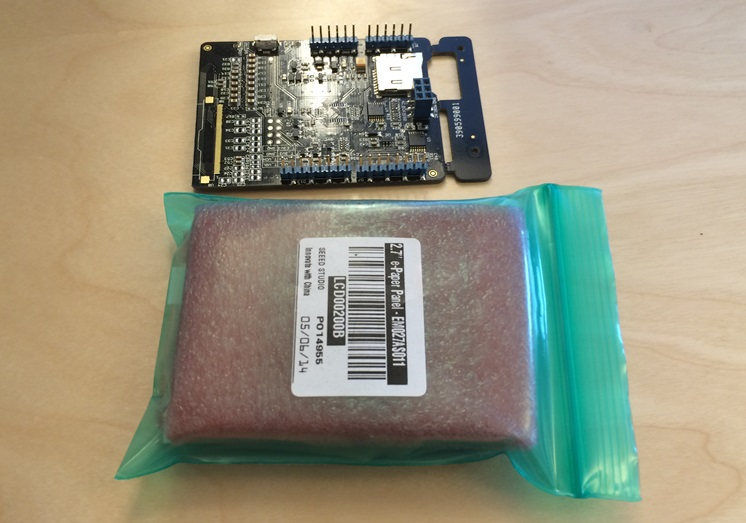
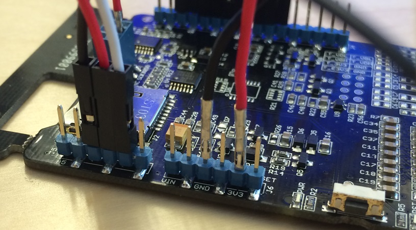

# Requirements
- 1x Nordic nrf51822 mbed mKIT development board https://mbed.org/platforms/Nordic-nRF51822/
- 1x E-Paper display http://www.seeedstudio.com/depot/27-ePaper-Panel-p-1596.html?cPath=34_82
- 1x E-Paper shield http://www.seeedstudio.com/depot/Small-epaper-Shield-p-1597.html
- 20x Female -> Female jumper wires http://www.seeedstudio.com/depot/1-pin-dualfemale-jumper-wire-100mm-50pcs-pack-p-260.html?cPath=44_47
- 5x Male -> Female jumper wires http://www.seeedstudio.com/depot/1-Pin-FemaleMale-Jumper-Wire-125mm-50pcs-pack-p-1319.html?cPath=44_47

This tutorial is part of a tutorial series on the [Nordic Pucks].
I am assuming that you have already read the [introduction tutorial] and the [location puck tutorial].

This tutorial will describe how to create a Bluetooth-enabled puck with an e-paper display. The display we have used is 264 x 176 pixels, and we're going to design a protocol which lets a connected device transmit an arbitrary black/white image to it via BLE. We will go through the necessary hardware setup, as well as the code needed to support it.

# Hardware

We will be using an e-ink display from seeedstudio. It comes with a shield which we are going to wire onto our nrf51822.

The connections we have chosen are as follows:

+----------+-----------------------+
| nRF51822 | Shield                |
|==========|=======================|
| p2       | D2 (M_EPD_PANEL_ON)   |
| p3       | D3 (M_EPD_BORDER)     |
| p4       | D4 (M_/SD_CS)         |
| p5       | D5 (M_EPD_PWM)        |
| p6       | D6 (M_EPD_/RESET)     |
| p7       | D7 (M_EPD_BUSY)       |
| p8       | D8 (M_EPD_DISCHARGE)  |
| p26      | D9 (M_/WORD_STOCK_CS) |
| p0       | D10 (M_/EPD_CS)       |
| p27      | A1 (M_OE123)          |
| p28      | A2 (M_CKV)            |
| p29      | A3 (M_STV_IN)         |
+----------+-----------------------+
| p20      |<-->   MOSI            |
| p22      |<-->   MISO            |
| p25      |<-->   SCK             |
+----------+-----------------------+
| VCC      |<--> VCC               |
| GND      |<--> GND               |
+----------+-----------------------+

mbed nrf pin numbering also available at https://mbed.org/platforms/Nordic-nRF51822/.

In the future a pin adaptor might be available for the nrf51822 which will make it easier to connect arduino shields.

# Software

Now that the hardware is all assembled, let's get on to writing some code. We assume you've already read the [Location Puck tutorial]. We're going to use the same Puck library for the display, so we create a new project and set it up just like the location puck.

For writing to the e-paper display we have ported an Arduino e-paper library over to mbed. This library should be included in your project. Grab it at http://mbed.org/teams/Nordic-Pucks/code/seeedstudio-epaper/. With it included, the EPD (_E_lectronic _P_paper _Display_) can be declared with the proper pin settings:

    EPD_Class EPD(p0, p2, p3, p8, p5, p6, p7);

For the display, we have defined a custom bluetooth service with it's own UUID ("bftj display    "). A bluetooth UUID is 128 bits long, so we use a convention with 16 letters of 8 bit each. 'bftj' is a general prefix we've decided to use for all our pucks' UUIDs, to avoid collisions with other vendors.

The display service provides two characteristics (see the BLE tutorial for more information about how services and characteristics work). One for sending commands such as 'start image' and 'end image', and one for transmitting actual image data.

The nrf51822 doesn't have a lot of available memory (8kb of RAM is available the programmer). As the display has 46464 pixels, we're not able to store entire images in memory at once. Because of this, our protocol revolves around sending and rendering images in chunks, so that only parts of the image ever needs to reside in memory at once. Specifically, We have designed the image transmission protocol to first transfer the LZ77-compressed upper half of the image, in-place-decompress it, and then draw it to the e-paper display. The same is then done for the lower part of the image.

To control this flow, we need to define some commands:

    #define COMMAND_NOOP 0
    #define COMMAND_CLEAR 1
    #define COMMAND_IMAGE_UPPER 2
    #define COMMAND_IMAGE_LOWER 3
    #define COMMAND_BEGIN_UPPER 4
    #define COMMAND_BEGIN_LOWER 5

Each pixel in the display can only be completely black or completely white (no greys, no colors), which means we only need one bit for each pixel. This means we can stuff 8 pixels together in one byte. Since we send only half the image at a time, we need a image buffer of 2904 bytes.

To reduce the amount of writes we need to do, a compression algorithm is used on the raw image data. When researching data compression algorithms, the LZ77 algorithm was found to have very little memory overhead during decompression (a plus in our memory constrained system) as well as a decent compression rate. It has a worst-case compressed file size slightly larger than the decompressed file size, so to be safe the receive buffer is initialized with a little extra room.

    #define IMAGE_SIZE 2904
    #define BUFFER_SIZE 2917
    #define Y_SIZE 88
    #define X_SIZE 264
    uint8_t buffer[BUFFER_SIZE];
    int currentCommand = COMMAND_NOOP;

Again, because of little available memory, we can't afford the luxury of having separate receive and image buffers. Therefore, received data is stored at the end of the image buffer, and will be decompressed to the same space. As we use the LZ77 compression algorithm, data will be decompressed incrementally. As data is decompressed, space will be freed up in the image buffer for storing the image.

Now, onto the code for receiving the command instructions. When we receive an `IMAGE_BEGIN` command, we set the `receiveIndex` (the index that we will write the received data to) to the end of the image buffer. It is then written backwards into the buffer as it is received. When we receive a command that tells us all the data has been transmitted, the received segment is flipped, decompressed, and finally written to the display.

<< THIS IMAGE NEEDS A LEGEND TO EXPLAIN WTF RED AND ORANGEyellow is, also wut is green >>

The code for this is as follows. Most of the magic here is happening inside the lz-compression, which we will not be looking into. The decompressed image is then flashed to the display.

    case COMMAND_IMAGE_UPPER:
        LOG_INFO("Writing image to top half of display.\n");
        reverseBufferSegment(receiveIndex, BUFFER_SIZE);
        LZ_Uncompress(buffer + receiveIndex, buffer, BUFFER_SIZE - receiveIndex);
        LOG_INFO("Uncompressed %i bytes of data.\n", BUFFER_SIZE - receiveIndex);
        EPD.begin(EPD_2_7);
        EPD.start();
        EPD.image(buffer, 0, EPD.lines_per_display / 2);
        EPD.end();
        break;
        
The code for flashing the lower half is more or less the same, with the exception of the coordinates we pass to the EPD.image method.

Next, receiving the data itself. Each time we write to the data characteristic, we can send 20 bytes. All we really need is a callback for the data characteristic write, which stores the received bytes in the receive buffer.

Now that we've got the methods for handling data transfer ready, let's hook it all up in the main function.

First, some setup for the display: (SOMEONE EXPLAIN THIS?!?!)

    int main() {
        DigitalOut SD_CS(p4);
        DigitalOut WORD_STOCK_CS(p26);
        
        SD_CS = 1;
        WORD_STOCK_CS = 1;

Next, we need to let the puck library know which characteristics we want to use.

    puck->addCharacteristic(DISPLAY_SERVICE_UUID, COMMAND_UUID, 1);
    puck->addCharacteristic(DISPLAY_SERVICE_UUID, DATA_UUID, 20);

And what we want to do when they are written to

    puck->onCharacteristicWrite(&COMMAND_UUID, onCommandWritten);
    puck->onCharacteristicWrite(&DATA_UUID, onDataWritten);

Then, we only need to tell the puck to start adveritising.

    puck->init(0x5EED);

Finally, we keep the puck alive in a while loop

    while (puck->drive());
