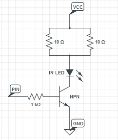
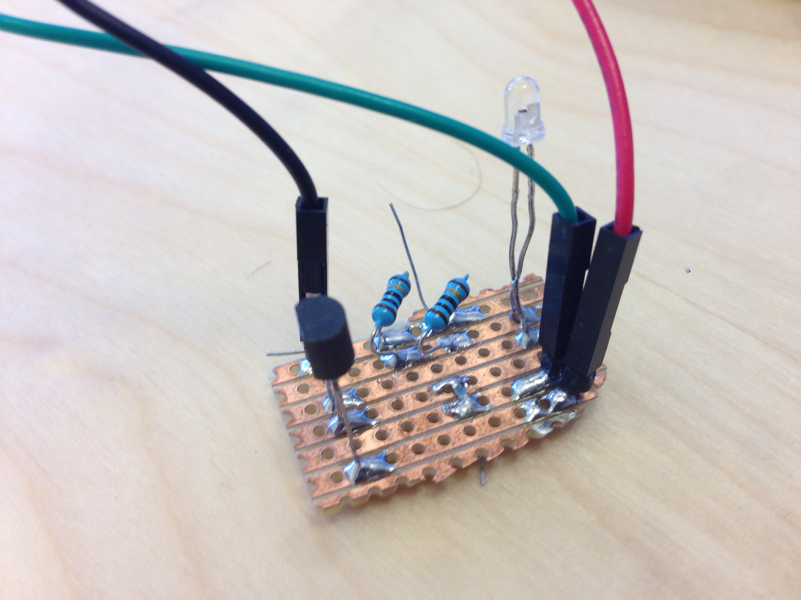

This tutorial is part of a tutorial series on the [Nordic Pucks].
I am assuming that you have already read the [introduction tutorial] and the [location puck tutorial].

In this tutorial, we will be building an IR puck, which is a puck that can mimic arbitrary infrared remote controls.
This is useful for controlling things like TVs, radios, airconditioners, window blinds, and just about anything and everything that can be otherwise be controlled by a regular remote control.

# Requirements
- 1x [Nordic nrf51822 mbed mKIT development board](https://mbed.org/platforms/Nordic-nRF51822/)
- 3x [Female to Female jumper wires](http://www.seeedstudio.com/depot/1-pin-dualfemale-jumper-wire-100mm-50pcs-pack-p-260.html?cPath=44_47)

### For custom IR sender
- IR led
- Resistors (1k and one for your IR led)
- NPN transistor
-  Soldering iron / solder
Something to solder on

This tutorial is part of a tutorial series on the [Nordic Pucks].
I am assuming that you have already read the [introduction tutorial] and the [location puck tutorial](location.html).

This is what the puck looks like: [image].

## Nitty Gritty IR details

A large majority of remote controls for common day-to-day appliances are based on sending commands wirelessly using infrared light.
Infrared light is simply light that is "too red" (i.e., the wavelength of the light is too long) to be seen by the human eye.
Computer sensors can detect them just fine however, which makes infrared a good candidate for cheap invisible wireless transmission over short distances.

Infrared remote controls send signals to the devices they want to control by flashing an infrared LED in a specific pattern.
Different patterns indicate different commands such as "play", "pause", "mute", and so on, and each manufacturer usually has their own set of patterns, different from each other.
This is done partly so that a command intended for your DVD player isn't incorrectly picked up by your stereo or TV set.
Although these patterns differ wildly, almost all are based on the same basic method: modulation.
In order make the patterns stand out against other sources of infrared background noise (for instance from the sun, candles, electric lighting, etc.), remote controls blink their LEDs in a very particular frequency, typically 38kHz, or 38 thousand times per second.
Binary bits are typically coded by differing how much time passes between each burst of 38kHz flashing.
For instance, many Samsung TVs will flash for 560 ms and stay silent for 560 ms to indicate a binary '0', and flash for 560 ms and stay silent for 1680 ms to indicate a binary '1'.

### NEC Modulation

Since there are so many different remote control signal coding standards used, making a universal remote can be quite a challenge.
Luckily, there is a [large database on the internet called LIRC] that has collected most of the different codes and standards used for popular home appliances.
Therefore, if you can find your remote control on LIRC, you can easily replace it with an IR puck!
If you can't find your particular remote control there, you can still pull out an oscilloscope or an IR receiver or similar, and simply measure the codes that the remote control uses, and replicate those in your puck.
If you're feeling particularly helpful, you can even contribute those codes to LIRC to help other hackers!

## Making your own IR sender

We made our own IR sender, if you too want to do that, here's our guide.
We assume you have basic soldering skills.

### Requirements:
- IR led
- Resistors (1k and one for your IR led)
- NPN transistor
- Soldering iron / solder
- Something to solder on

When dealing with IR on the mbed we found that the power from the GPIO pins were not sufficient to light our IR led.
Because of this we needed a bigger power source. We wired the LED directly to VCC on the board and used a NPN transistor to control if the led should light or not.
A NPN transistor has three legs, a collector, and emitter and a base.
When the base is driven high the collector and emitter circuit is connected and the current flows through.
In our case this means that the LED will start lighting.
Our IR puck uses PIN14 to drive the LED signal. You can see our circuit drawing below.

Our LED needed a 5 ohm resistor so we used two 10 ohm resistors in parallel.
Be sure to check your own LED to make sure it doesn't break.
Another noteworthy thing is that you should use thru-hole resistors for the LED as most on-board resistors will not handle the high temperature from the voltage over time very well.

Here you can see our implementation of this circuit board we used for our IR puck.

The green wire in connected to PIN14, the black to VCC and the red to GND.
Here you can see our drawing for this specific implementation.

.jpg)

Once you have soldered up everything and connected all the wires, you are ready to flash the mbed with the IR puck program.
We have written a working example program for an IR puck that you can use directly, or you can tweak it to your needs or even write your own.
Our program is available at [mbed dot org]. It uses our [Puck library], a convenience wrapper library that makes it easy to make Pucks.
You can read more about the library in our [nice in-depth library article], but it is not required to be able to use it efficiently.

# Software

Main.c

    #include "mbed.h"

Virtually all mbed programs start with including mbed.h, which is the mbed library.

    #include "IR.h"

The IR-specific logic is in a separate file to keep things organized, so we need to include IR.h to make sure we can call that logic from our main program.

    #define LOG_LEVEL_INFO
    #include "Puck.h"

Since we're making a Puck, we're going to use our Puck wrapper library.
We can configure the amount of logging the puck library will do for us using the LOG_LEVEL_* directives, which you can read more about in the [puck library tutorial].
Here we have chosen LOG_LEVEL_INFO, which is useful for testing and verifying that the puck is functional, but when development is complete, you should switch to LOG_LEVEL_NONE to increase performance and reduce battery usage.
Other valid settings are LOG_LEVEL_VERBOSE, LOG_LEVEL_DEBUG, LOG_LEVEL_WARN and LOG_LEVEL_ERROR.

    Puck* puck = &Puck::getPuck();

This is how you get a reference to the Puck object from the puck library.

    const UUID IR_SERVICE_UUID = stringToUUID("bftj ir ");
    const UUID HEADER_UUID = stringToUUID("bftj ir header ");
    const UUID ONE_UUID = stringToUUID("bftj ir one ");
    const UUID ZERO_UUID = stringToUUID("bftj ir zero ");
    const UUID PTRAIL_UUID = stringToUUID("bftj ir ptrail ");
    const UUID PREDATA_UUID = stringToUUID("bftj ir predata ");
    const UUID CODE_UUID = stringToUUID("bftj ir code ");

Here we define the different UUIDs of the services and characteristics we intend to use.
For more information about how services and characteristics work, check out our [BLE tutorial].

We have a couple different characteristics that together make up the IR signal.
These together make up the ir signal, each characteristic have one or two values that either say how long on and off the signal should be or in the case of code, what code is being sent.

- Header
Most IR signals have a header to say that a signal is coming. This is, for instance, in the case of Apple Remote 9500, 4500.
- One
How long on and off is a one? Apple Remote 560, 1650
- Zero
How long on and off is a zero? Apple Remote 560, 560
- pTrail
What is the tail data? Apple Remote: 560
- Predata
Some controls have predata that comes before the header
- Code
What code that the remote is going to send out. Apple play: 0x04 

    void onIRCodeWrite(uint8_t* value) {
        LOG_INFO("Going to fire IR code...\n");
        fireIRCode(puck->getCharacteristicValue(HEADER_UUID),
            puck->getCharacteristicValue(ONE_UUID), 
            puck->getCharacteristicValue(ZERO_UUID),
            puck->getCharacteristicValue(PTRAIL_UUID),
            puck->getCharacteristicValue(PREDATA_UUID),
            puck->getCharacteristicValue(CODE_UUID));
        LOG_INFO("Fire complete!\n");
    }

Here we define onIRCodeWrite, which will get called by when the ir code characteristic gets updated over bluetooth.
It simply calls fireIRCode using the current values of the different characteristics.

    int main() {

The program entry point.

    puck->addCharacteristic(IR_SERVICE_UUID, HEADER_UUID, 4);
    puck->addCharacteristic(IR_SERVICE_UUID, ONE_UUID, 4);
    puck->addCharacteristic(IR_SERVICE_UUID, ZERO_UUID, 4);
    puck->addCharacteristic(IR_SERVICE_UUID, PTRAIL_UUID, 2);
    puck->addCharacteristic(IR_SERVICE_UUID, PREDATA_UUID, 2);
    puck->addCharacteristic(IR_SERVICE_UUID, CODE_UUID, 2);

Here we tell the puck library which characteristics we want to offer over bluetooth, and which service(s) they belong to.
The last argument of the addCharacteristic function call tells the puck library how many bytes the characteristic should be. This can be any number from 1 to 20.

    puck->init(0xABBA);

Once all the characteristics have been added (but not before), the puck can be initialized.
This lets the puck library know that it can start performing some low-level start-up and house-cleaning.
The argument is the puck's identification number used for the location features of the puck.
Each location needs a unique identification code, which can be anywhere between 0 and 0xFFFF. Once init has been called, we are ready to start the main loop of the program.

    puck->onCharacteristicWrite(CODE_UUID, onIRCodeWrite);

Here we tell the puck library that we want the onIRCodeWrite function to be called whenever someone writes to the ir code characteristic over bluetooth.

    while (puck->drive());

Finally, when everything is initialized, hooked up and ready, we can run the main loop of the program.
In order to let the puck and bluetooth stack do its business, puck->drive() should be called periodically.
If you have some custom logic that wants to be polled regularly, this is the place you would put it, but for this example, all the necessary logic is contained within the puck library.

    }
