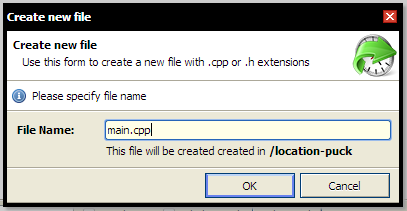
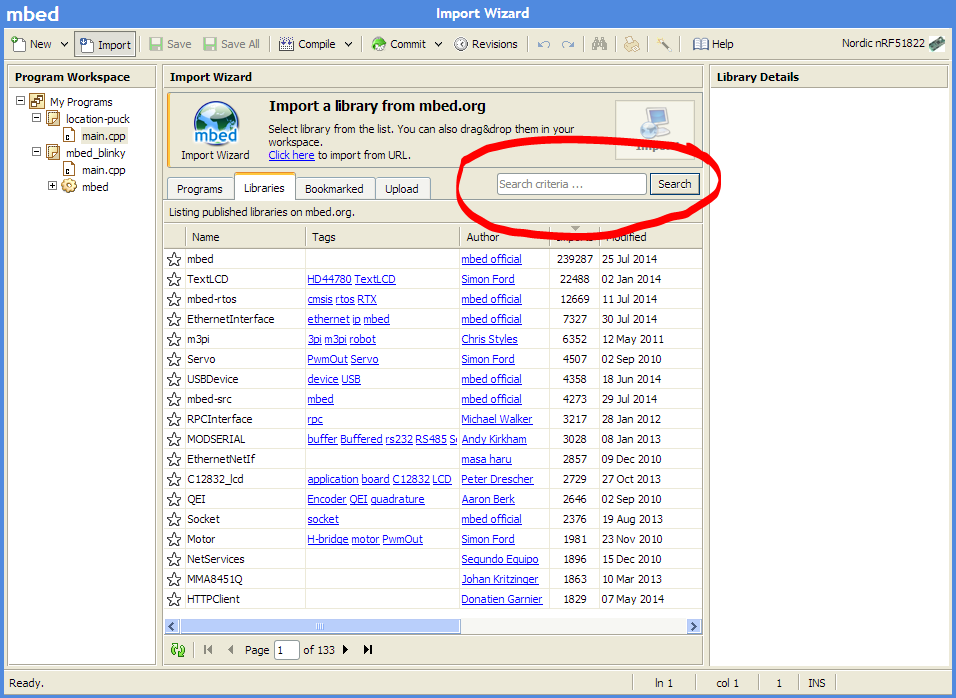
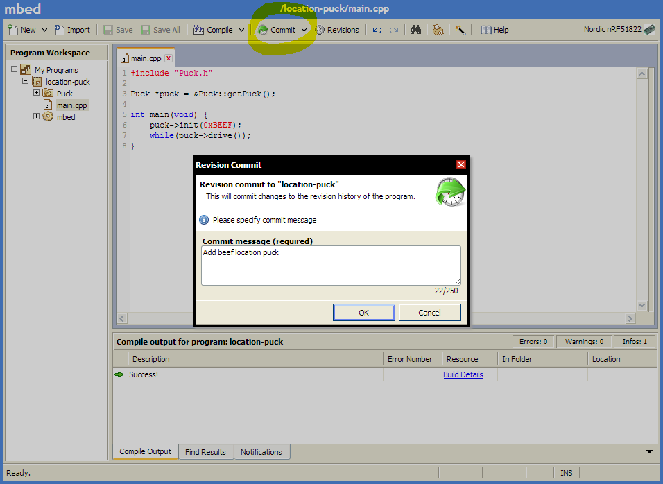
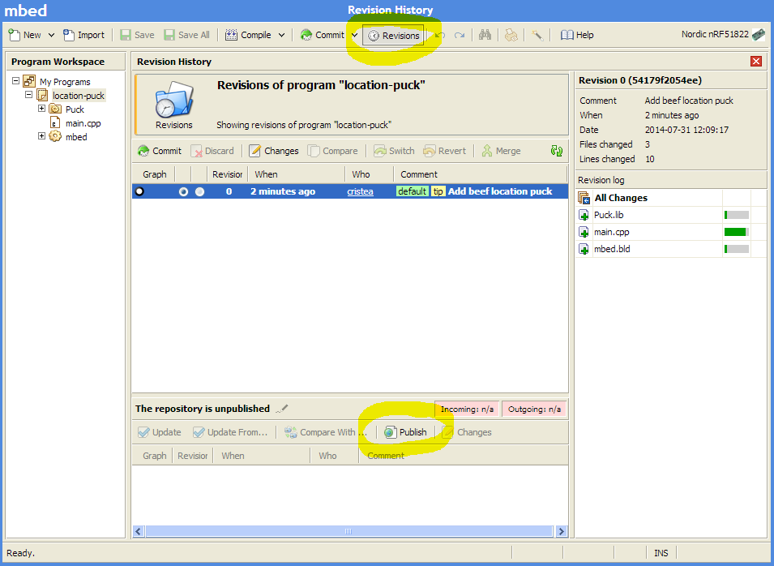

This tutorial will teach you how to set up a location puck - the basic puck that all of our other pucks are based upon.
If you are not familiar with pucks or our project, please read our [introductory post here](/).
In short, a puck is a Bluetooth Low Energy-powered device that will, using your smartphone as a central hub, work as a building block for your Internet-of-Things-related needs. 

# Requirements
- 1x [Nordic nRF51822 mbed mKIT development board](https://mbed.org/platforms/Nordic-nRF51822/)

# Location Puck
The location puck will give your smartphone context about the phone's location.
You can later set up rules for what should happen at different locations. More on rules later.

## 1. Create a location puck {#create}
If you are not familiar with the mbed development system, [please read this tutorial first](mbed.html).

We are going to create a location puck from scratch.
To do this, create a new program, but change the template to "Empty program".
Name your program something cool and press OK. Right click on your newly created program in the left column, and select New File. Name your file main.cpp.

> 
> Creating a new file in the Compiler

Now we have an empty main.cpp file, but before we write some code, we want to import a library that we've created.
It's a Puck library, which makes Puck creation very easy by handling some of the more tedious housekeeping required to keep a puck running.
To do this we make sure to have selected our puck project and press the "Import" button next to the "New" button on the top bar.
Alternativly we can press CTRL/CMD + I. We are now prompted with the Import Wizard. This wizard lets you import libraries from mbed.org.

> 
> mbed.org Compiler import wizard with the search field encircled

The first thing you will be prompted with is the mbed library.
This is a vital library you will need in all of your projects. Import that one first.
You have a search box in your import Wizard, type in the words Puck and select the version from Team Nordic Pucks. Double click that line to import the Puck library.

> mbed_import_puck_lib.PNG

You can now see all the files in our Puck library.
Most of the files are not important right now, but note the file named Puck.h.
This file contains all of the bootstrapping code necessary for making a Puck.
Go back to main.cpp and write the following code to make a location puck.


#include "Puck.h"

Puck *puck = &Puck::getPuck();

int main(void) {
    puck->init(0xBEEF);
    while(puck->drive());
}


The first line of code after the include is where we get a reference to the global Puck object.
This object takes care of setting up Bluetooth. In the main function we initialize our puck and pass in an identifying number.
This number is what the accompanying apps are using when they connect to the pucks.
It is not important exactly what this number is per se, but it needs to be unique for all your Pucks.
After this is done, your setup is complete - the only thing left is to tell the puck that it needs to be running.
This is done in the drive-method of the puck object.
This methods returns true when driven, which means you can have it inside the expression part of a while loop.

## 2. Publish your puck
Now you are ready to publish your great work!
Publishing your puck is a two step process. First you need to commit your changes with a comment about what you have done, and afterwards you publish your work.
Your published work can be either public, unlisted or private.
When you are finished with your program press "Commit" from the top bar or CTRL/CMD + SHIFT + C.
Write a message that's descriptive of what you've done.

> 
> Commit message box for entering your commit message

Afterwards press the "Revisions" button next to the "Commit" button to see all your commits.
If you are happy with what you've got, you can press the "Publish" button to publish your brand new puck program.

> 
> Revisions view and publish button

You will be prompted with a few choices.
Choose the ones that make sense for you. One important thing is to note if you have a program or a library.
This tutorial makes a program which is what you should choose here.
Also make a choice about visibility of your program. When you press OK you will get a link to where your program is on mbed.org.

> 
> Finished location puck

# Complete {#complete}

Congratulations! You are now done with this tutorial!
You have a fully functioning location puck!
You can read about how to use this location puck with your smartphone in our [Smart Phone app guide](smartphone-apps.html).
These guides will introduce you to the concept about rules for you pucks. This is the technique we use to make your pucks interact with your phone.
