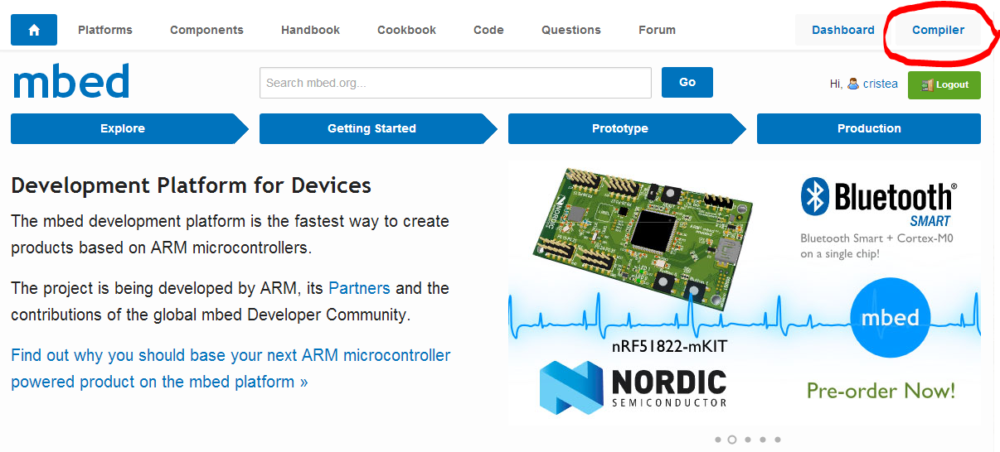
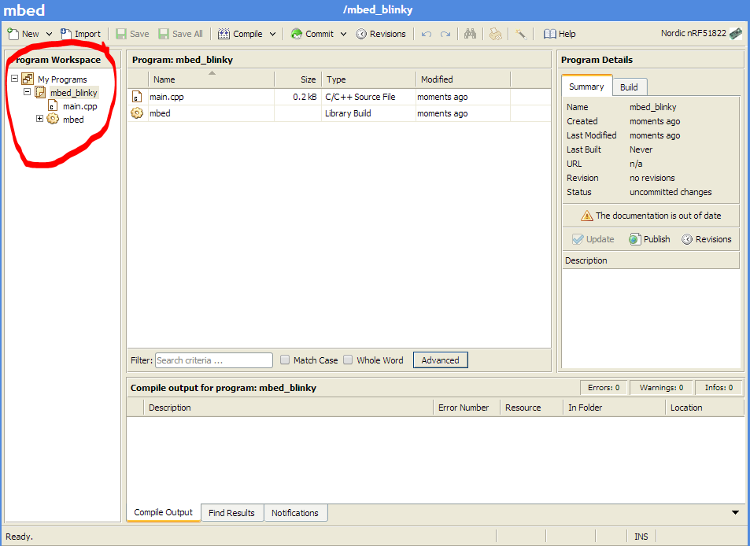

This tutorial will teach you how to set up a location puck - the basic puck that all of our other pucks are based upon.
If you are not familiar with pucks or our project, please read our [introductory post here](/).
In short, a puck is a Bluetooth Low Energy-powered device that will, using your smartphone as a central hub, work as a building block for your Internet-of-Things-related needs. 

# Requirements
- 1x [Nordic nRF51822 mbed mKIT development board](https://mbed.org/platforms/Nordic-nRF51822/)

# Location Puck
The location puck will give your smartphone context about the phone's location.
You can later set up rules for what should happen at different locations. More on rules later.

## 1. Register on mbed.org and add Nordic nRF51822 to your online IDE
First thing's first - set up your IDE. We will use the official mbed IDE in the browser.
This allows for extremely mobile development as you are not bound by your own computer to do development.
Another huge benefit is that you do not need to set up any development stack locally (!).

When an mbed is connected to your computer it will show up as a USB drive, in the same way a memory stick does.
Compiling your code at mbed.org will download a .hex file to your computer, which when copied over to your mbed will update it with your program.
The mbed will flash its lights for a few seconds, and afterwards you will need to press the reset button in order to start your newly transferred (flashed) program.

First go to http://www.mbed.org

> 
> mbed.org front page with signup button encircled

Press the login or signup button and create yourself a user account.

After having done so, log in with your newly created user.
You will be able to enter the online IDE now and start your own projects!
The online IDE for mbed is called "Compiler". It is where you will write your code, import libraries and even review pull requests, all in the browser.
Press the compiler button in the top right corner to enter the compiler.

> 
> mbed.org front page with the compiler button encircled

When you first enter the compiler it will look like any other program on your computer.
This is the compiler you will use for every mbed out there.
You therefore have to start off by adding your mbed to your compiler.
Do this by pressing the "No device selected" button.

> 
> mbed.org compiler with device button highlighted

You will be prompted with a button that says "Add Platform" with a big plus sign on it.
Press that button and add your "Nordic nRF51822" device to the compiler by first selecting that one from the list and press "Add to your mbed Compiler" in the new window.

> 
> Add to your mbed Compiler button on mbed.org

Go back to your compiler and press the "No selected device" button again.
Now select your "Nordic nRF51822" device by pressing that one first and the "Select platform" button after. You are now ready to add some programs to your compiler.

## 2. Create your first program in the online compiler
To create a new program in your compiler press the New button in the top left side of the compiler.
If you press the arrow on the side, you are prompted with multiple choices as to what kind of code you are writing, select New Program. You will now have some choices to what you program is.

> 
> Create a new program in the mbed.og Compiler

The platform should be set to Nordic nRF51822.
You also have the choice to pick a template for your program.
This is very useful for learning how to do new things on the mbed platform.
We will choose the Blinky LED Hello World template.
The last choice is a checkbox telling you that it will update this program and libraries to the latest revision.
This is a good idea, since new revisions often bring in bugfixes and makes the libraries you are using more stable.

> 
> mbed.org Compiler with programs highlighted

On the right side after you have added a new program you will see your programs.
The folder named mbed_blinky (or whatever you named your program) is your program.
The first program, blinky, has a couple of files. The first one is the main.cpp file.
This is where your code goes. If you press it, you will see a standard program which will cause a LED on your mbed to flash.
You can see that there is an "mbed.h" file included in your main.cpp.
This is a standard library file which contains a lot of code to help you with mbed.
Familiarizing with the APIs that mbed provides is recommended.
If you want to see how you can easily find documentation and API reference, please take a look here: [API documentation](http://mbed.org/handbook/API-Documentation).

The second file in your program is named mbed and looks like a gear.
This is the library that you are including in your main.cpp file.
Generally if you have a gear, or a folder with a gear on, you are dealing with a library.
Libraries provide code written by others that makes your development easier.

To run your code you press the "Compile" button in the top center.
Or alternatively press CTRL/CMD + D. A .hex file will be downloaded to your computer, which you can drag over to your mbed form the file explorer, and the mbed will flash the new software.
Reset the mbed and you should see a LED flashing.

## 3. Create a location puck
We will now create a location puck from scratch.
To do this, create a new program, but change the template to "Empty program".
Name your program something cool and press OK. Right click on your newly created program in the left column, and select New File. Name your file main.cpp.

> 
> Creating a new file in the Compiler

Now we have an empty main.cpp file, but before we write some code, we want to import a library that we've created.
It's a Puck library, which makes Puck creation very easy by handling some of the more tedious housekeeping required to keep a puck running.
To do this we make sure to have selected our puck project and press the "Import" button next to the "New" button on the top bar.
Alternativly we can press CTRL/CMD + I. We are now prompted with the Import Wizard. This wizard lets you import libraries from mbed.org.

> 
> mbed.org Compiler import wizard with the search field encircled

The first thing you will be prompted with is the mbed library.
This is a vital library you will need in all of your projects. Import that one first.
You have a search box in your import Wizard, type in the words Puck and select the version from Team Nordic Pucks. Double click that line to import the Puck library.

> mbed_import_puck_lib.PNG

You can now see all the files in our Puck library.
Most of the files are not important right now, but note the file named Puck.h.
This file contains all of the bootstrapping code necessary for making a Puck.
Go back to main.cpp and write the following code to make a location puck.


#include "Puck.h"

Puck *puck = &Puck::getPuck();

int main(void) {
    puck->init(0xBEEF);
    while(puck->drive());
}


The first line of code after the include is where we get a reference to the global Puck object.
This object takes care of setting up Bluetooth. In the main function we initialize our puck and pass in an identifying number.
This number is what the accompanying apps are using when they connect to the pucks.
It is not important exactly what this number is per se, but it needs to be unique for all your Pucks.
After this is done, your setup is complete - the only thing left is to tell the puck that it needs to be running.
This is done in the drive-method of the puck object.
This methods returns true when driven, which means you can have it inside the expression part of a while loop.

## 4. Publish your puck
Now you are ready to publish your great work!
Publishing your puck is a two step process. First you need to commit your changes with a comment about what you have done, and afterwards you publish your work.
Your published work can be either public, unlisted or private.
When you are finished with your program press "Commit" from the top bar or CTRL/CMD + SHIFT + C.
Write a message that's descriptive of what you've done.

> 
> Commit message box for entering your commit message

Afterwards press the "Revisions" button next to the "Commit" button to see all your commits.
If you are happy with what you've got, you can press the "Publish" button to publish your brand new puck program.

> 
> Revisions view and publish button

You will be prompted with a few choices.
Choose the ones that make sense for you. One important thing is to note if you have a program or a library.
This tutorial makes a program which is what you should choose here.
Also make a choice about visibility of your program. When you press OK you will get a link to where your program is on mbed.org.

> 
> Finished location puck

mbed Location Puck

Congratulations! You are now done with this tutorial!
You have a fully functioning location puck!
You can read about how to use this location puck with your smartphone in one of our puck app guides:

- iOS: <#link to iOS guide here#>
- Android: <#link to Android guide here#>

These guides will introduce you to the concept about rules for you pucks. This is the technique we use to make your pucks interact with your phone.
