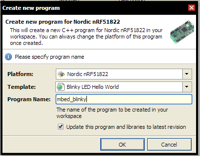

# Intro to mbed online development system

First things first - set up your IDE. We will use the official mbed IDE which runs in your browser.
This allows for extremely mobile development as you are not bound by your own computer to do development.
Another huge benefit is that you do not need to set up any development stack locally (!).

When an mbed is connected to your computer it will show up as a USB drive, in the same way a memory stick does.
Compiling your code at mbed.org will download a .hex file to your computer which when copied over to your mbed will update it with your program.
The mbed will flash its lights for a few seconds, and afterwards you will need to press the reset button in order to start your newly transferred (flashed) program.

## 1. Register on mbed.org

First go to <http://www.mbed.org>

> 
> mbed.org front page with signup button encircled

Press the login or signup button and create yourself a user account.

After having done so, log in with your newly created user.
You will be able to enter the online IDE now and start your own projects!
The online IDE for mbed is called "Compiler". It is where you will write your code, import libraries and even review pull requests, all in the browser.
Press the compiler button in the top right corner to enter the compiler in a new tab.

> 
> mbed.org front page with the compiler button encircled

## 2. Add Nordic nRF51822 to the online IDE

When you first enter the compiler it will look like any other program on your computer.
This is the compiler you will use for every mbed out there.
You therefore have to start off by adding your mbed platform to the compiler.
Do this by pressing the "No device selected" button.

> 
> mbed.org compiler with device button highlighted

You will be prompted with a button that says "Add Platform" with a big plus sign on it.
Press that button and add your "Nordic nRF51822" device to the compiler by first selecting that one from the list and press "Add to your mbed Compiler" in the new window.

> 
> Add to your mbed Compiler button on mbed.org

Go back to your compiler and press the "No selected device" button again.
Now select your "Nordic nRF51822" device by pressing that one first and the "Select platform" button after. You are now ready to add some programs to your compiler.

## 3. Create your first program in the online compiler

To create a new program in your compiler press the New button in the top left side of the compiler.
If you press the arrow on the side, you are prompted with multiple choices as to what kind of code you are writing, select New Program.
You will now have some choices to what you program is.

> 
> Create a new program in the mbed.og Compiler

The platform should be set to Nordic nRF51822.
You also have the choice to pick a template for your program.
This is very useful for learning how to do new things on the mbed platform.
We will choose the Blinky LED Hello World template.
The last choice is a checkbox telling you that it will update this program and libraries to the latest revision.
This is a good idea, since new revisions often bring in bugfixes and makes the libraries you are using more stable.

> 
> mbed.org Compiler with programs highlighted

On the right side after you have added a new program you will see your programs.
The folder named mbed_blinky (or whatever you named your program) is your program.
The first program, blinky, has a couple of files. The first one is the main.cpp file.
This is where your code goes. If you press it, you will see a standard program which will cause a LED on your mbed to flash.
You can see that there is an "mbed.h" file included in your main.cpp.
This is a standard library file which contains a lot of code to help you with mbed.
Familiarizing with the APIs that mbed provides is recommended.
If you want to see how you can easily find documentation and API reference, please take a look here: [API documentation](http://mbed.org/handbook/API-Documentation).

The second file in your program is named mbed and looks like a gear.
This is the library that you are including in your main.cpp file.
Generally if you have a gear, or a folder with a gear on, you are dealing with a library.
Libraries provide code written by others that makes your development easier.

To run your code you press the "Compile" button in the top center.
Or alternatively press CTRL/CMD + D. A .hex file will be downloaded to your computer, which you can drag over to your mbed form the file explorer, and the mbed will flash the new software.
Reset the mbed and you should see a LED flashing.

[Now go and read how to make your location puck!](location.html)
