# Introduction

At the core of all the pucks, and acting as the central, giving the pucks access to the outside world (the internet), is your smart phone.

> 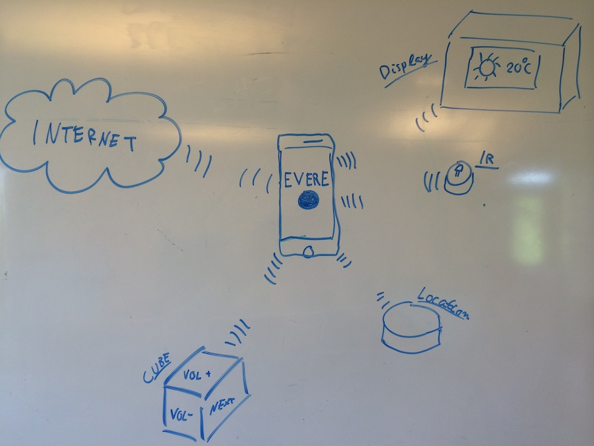

Your (Bluetooth LE compliant) smart phone can connect to all of these devices by running either the Android or iOS app that we've developed (known as Puck Central), or your own client-side application.
From Puck Central you can subscribe to Puck events such as entering or leaving a zone, and triggering reactions thereupon. For example, entering your home library might set your phone to silent mode.

This tutorial will show you how to use Puck Central to set up your own rules and triggers, and corresponding actions.

## Pucks

For the application to be able to listen in for events on pucks, and to avoid spam from unknown pucks, each puck has to be paired with the application before further usage.
Pairing is achieved by holding your smartphone close to a puck, and filling in the pair-puck popup that will appear.

> 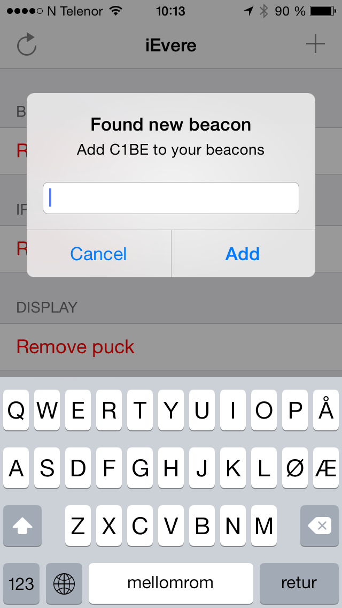
> 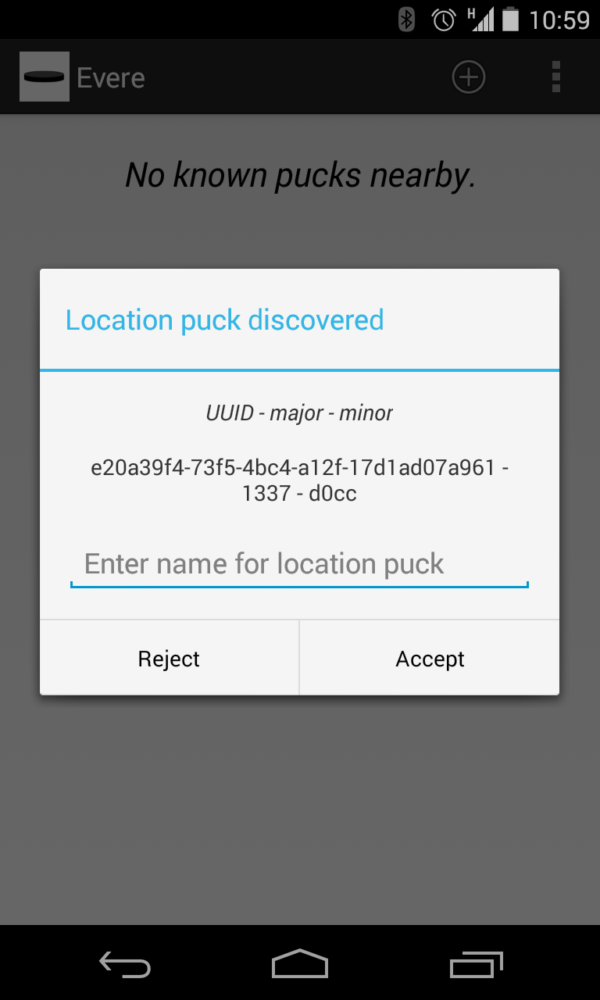
{: .two-images}

We're now ready to create our own rules.

## Rules

A rule is composed of three parts: A puck identifier, an event to listen for (trigger), and a set of actions to execute.
When Puck Central notices that an event has triggered for a certain puck, the application looks in its database for a rule matching the puck and event triggered. If a matching rule is found, the actions of the rule are triggered.

> 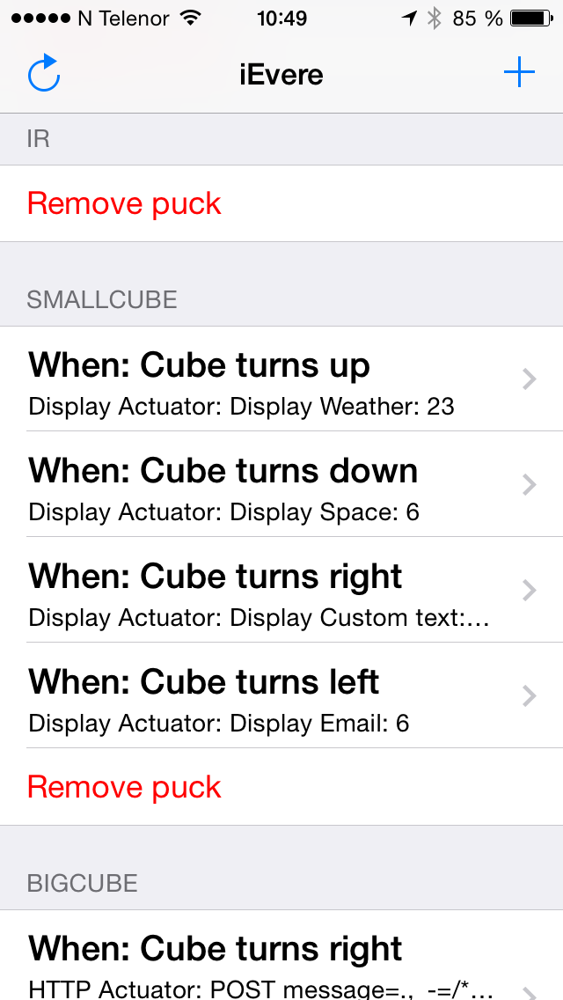
> 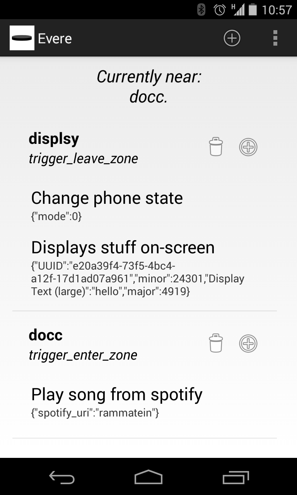
{: .two-images}

## Triggers

The available triggers for a given Puck depend on what features the puck advertises that it supports. Here follows a concise overview of the currently supported triggers.

All Pucks (includes Location Puck, Cube Puck, IR Puck, Display Puck):

- Enter location
- Leave location

Cube Puck:

- Rotation change (separate triggers for up, down, left, right, front, back)

## Actions

Puck Central comes preloaded with a number of actuators that can be triggered via rules, including the following:

- Play music from spotify
- Change phone state (silent, vibrate, volume)
- Change music volume
- Post data to webpages.

If a Display Puck or IR Puck is present, two additional actuators will appear:

- Send IR Signal
- Send Image / Text

You can also create your own actuators. Read more about this in the [ Application Architecture ] tutorial.

## Creating and deleting rules

Creating a rule is pretty simple:

- Click the 'add' icon in the action bar
- Select which Puck to add a rule for

> 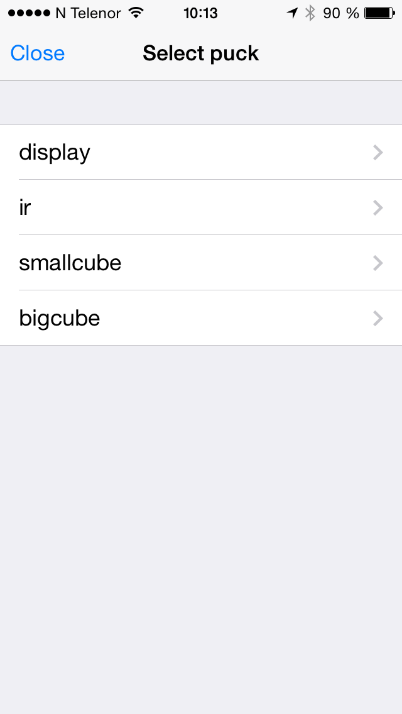
> 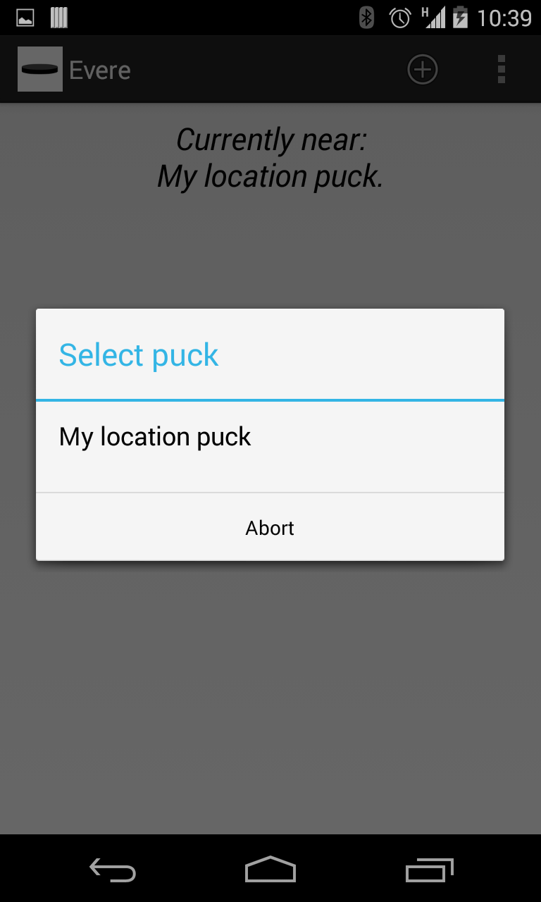
{: .two-images}

- Select an event (trigger) to listen for

> 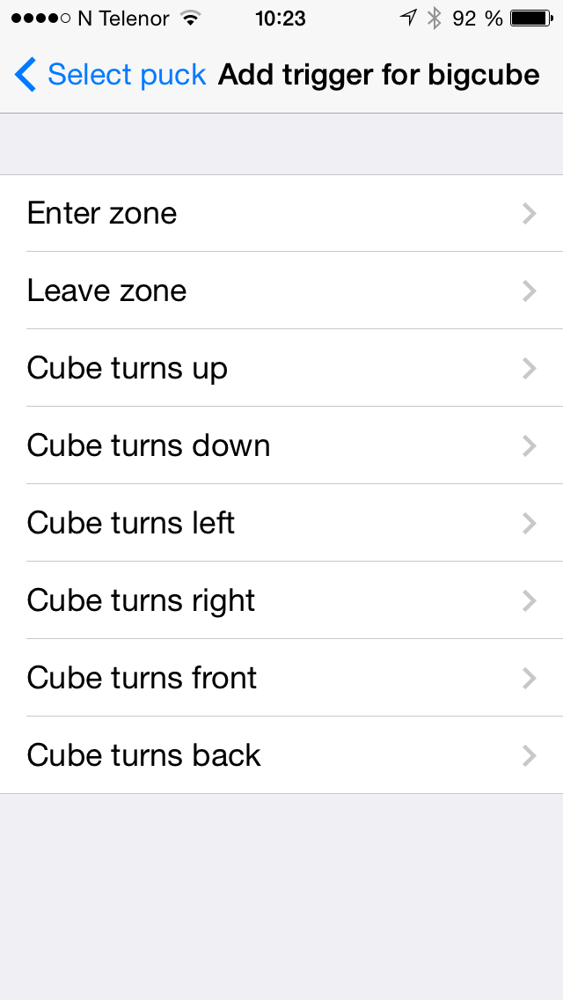
> 
{: .two-images}

- Select an actuator (action) to be triggered when the rule is fired.

> 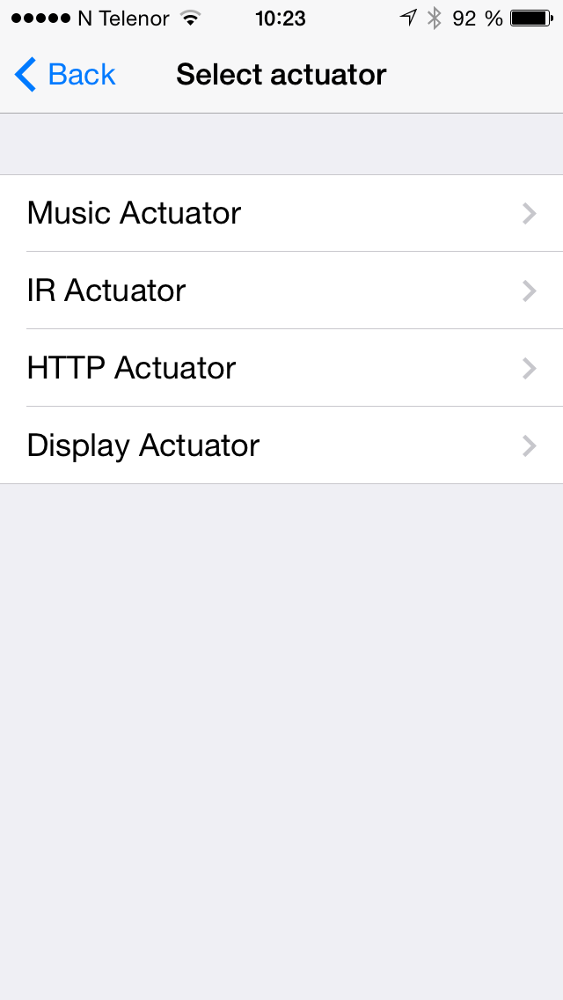
> 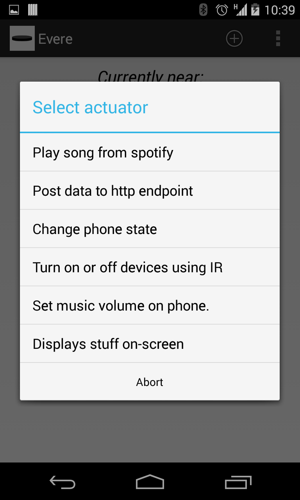
{: .two-images}

- Customise actuator settings (if any)

> 
> 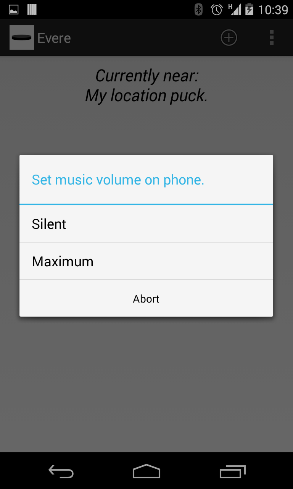
{: .two-images}

- And you're done!

To delete a rule, click 'Remove Puck' on iOS, and the garbage bin icon on Android.

## Extending Puck Central with custom actions and actuators

If you wish to extend the client application with your own actuators, you can read how to do so at the github pages of the respective applications.

- Puck Central android link
- Puck Central iOS link

