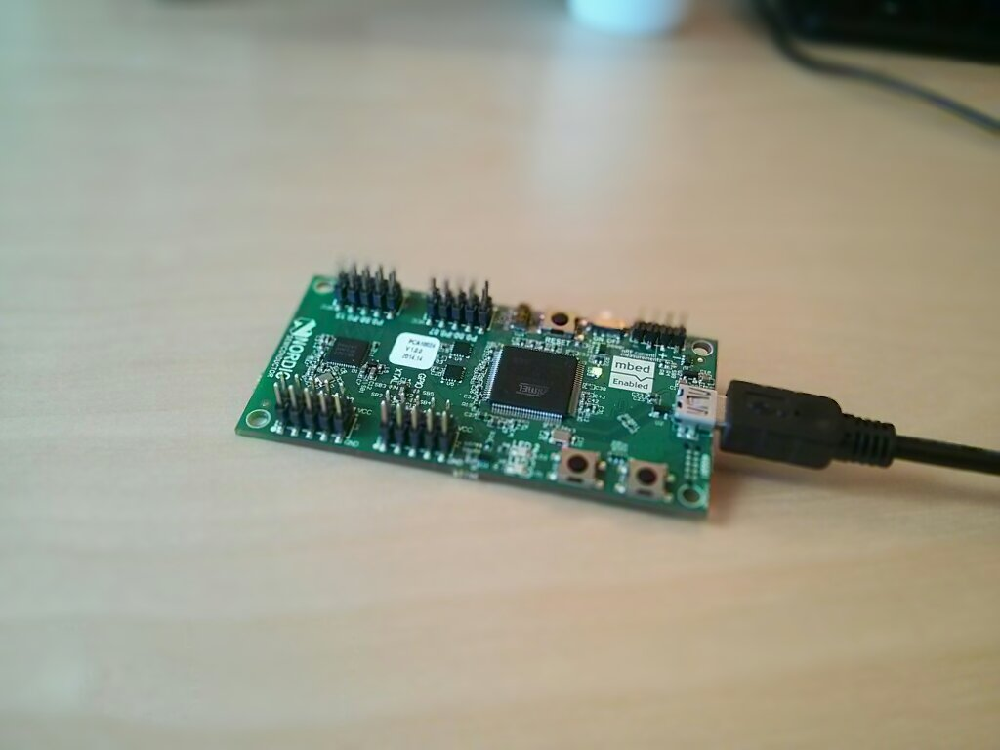
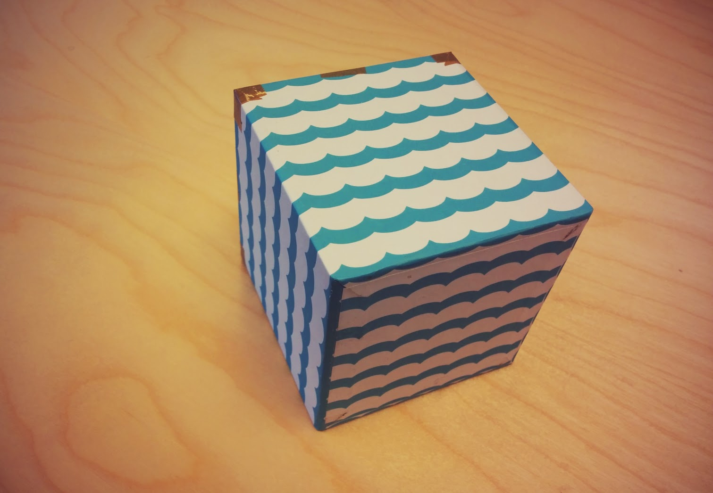
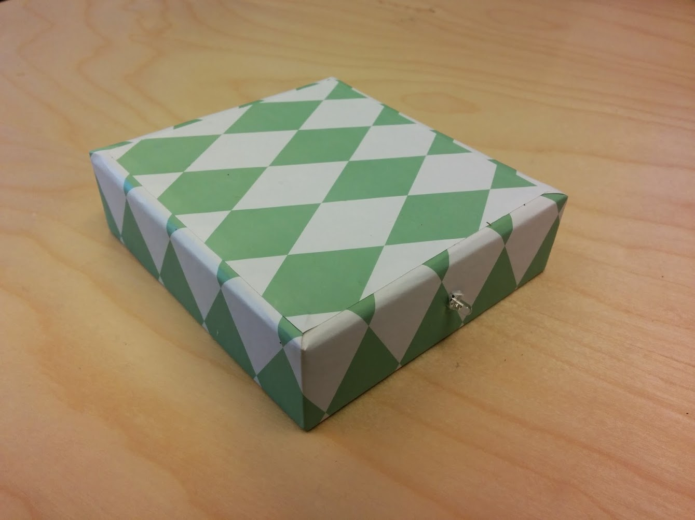
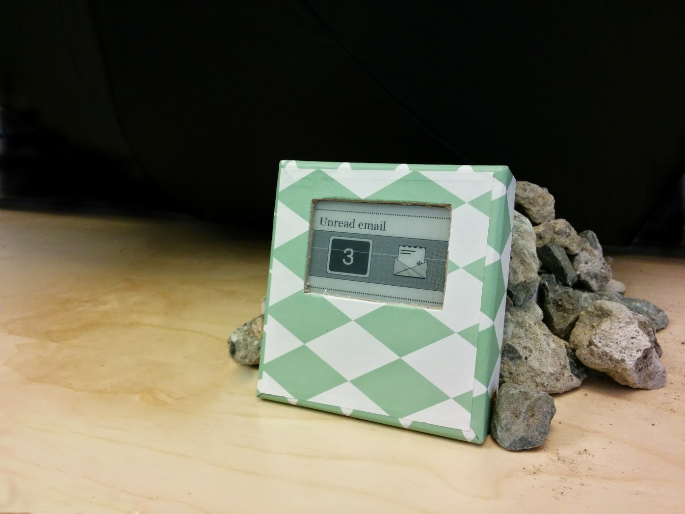

Raspberry Pi took the maker community by storm when it launched in 2012.
With its internet access it allowed small projects to be internet-of-things enabled.
We have created a platform to take this one step further.

Our platform, called the Puck platform, is an internet of things platform for mbed.
mbed makes it easy to program embedded hardware for people new to embedded systems.
Our platform is built upon the first mbed chip with Bluetooth, created by Nordic Semiconductor.
We hope to create a community around these BLE devices where people contribute to the project, and share their designs with each other. Everything is open-source, of course, with lots of supporting materials.

> The Raspberry Pi of Bluetooth

We make it easy to rapidly prototype and develop Bluetooth LE enabled devices - get up and running in under 10 lines of code, written directly in the browser.

Whether you want to monitor your door to tell if it's open or closed, or maybe your want to text your wife when you leave work, together, now's the time to make that project.

We've developed a handful of awesome examples to demonstrate the platform. These examples are named 'Pucks'.
By talking to the internet through your smartphone, the barrier to creating your own Internet of Things device is lower than ever.

> 

The fundamentals of a puck is that it will always broadcast its position.
This is very powerful, and makes even the simplest puck able to give context to all smart devices listening.
If you leave a puck in your bedroom at night, the smart device can automatically go to do not disturb mode for the night, and based on the day, set the correct alarm.
Only the imagination sets limits for what this system is able to do.

As a showcase of how powerful pucks can be, we have created three pucks.
These work together with the smart device, and as an extension, with each other.
We have [tutorials](tutorials.html) on how each of these pucks are made that you can find on this webpage.

> 

**The cube puck!** With a single rotation you can change the mode for your environment.

- Want the movie to pause or the music to turn off? Rotate the cube.
- Want to set a timer for 5 minutes? Rotate the cub.
- Want the A/C to be a tiny bit colder? Rotate the cube.

> 

**The IR puck!** Command any infrared device.

Any TV, DVD player, radio, stereo and more can be controlled.
Use this together with the cube and the cube becomes a remote controll for all your IR item.

> 

**The display puck!** Display any text or black/white image on an e-paper display.

Get the weather information displayed on this puck when you come near it.
Always be able to access information when you need to without having to pull up your phone.

To get started making your own pucks, you can have a look at our [location puck tutorial](tutorials/location.html)
